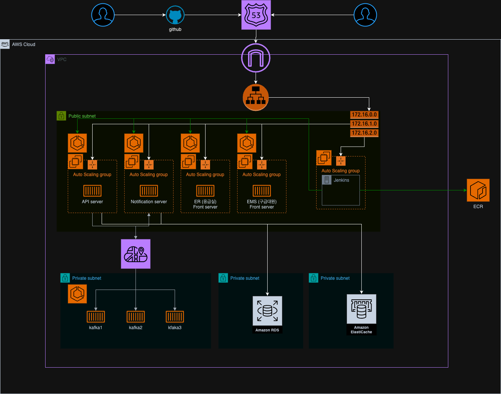
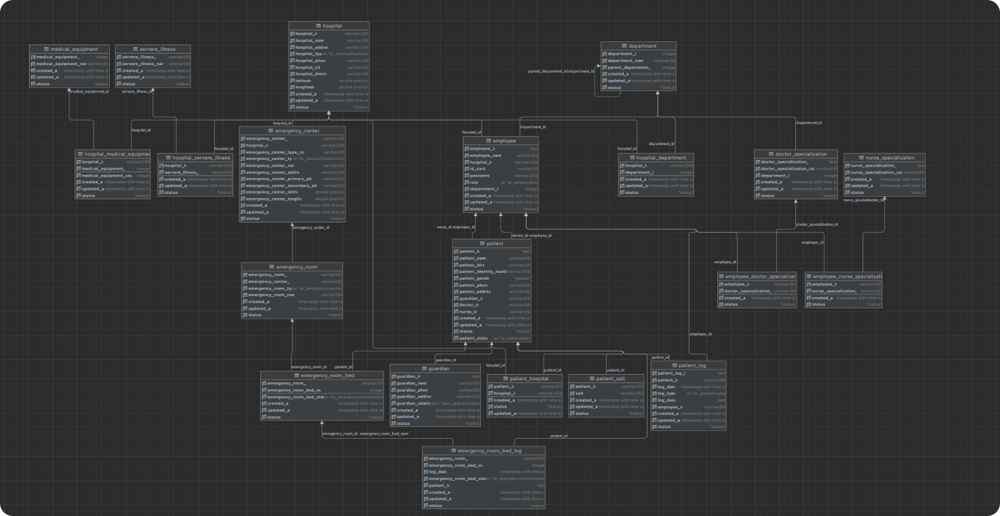
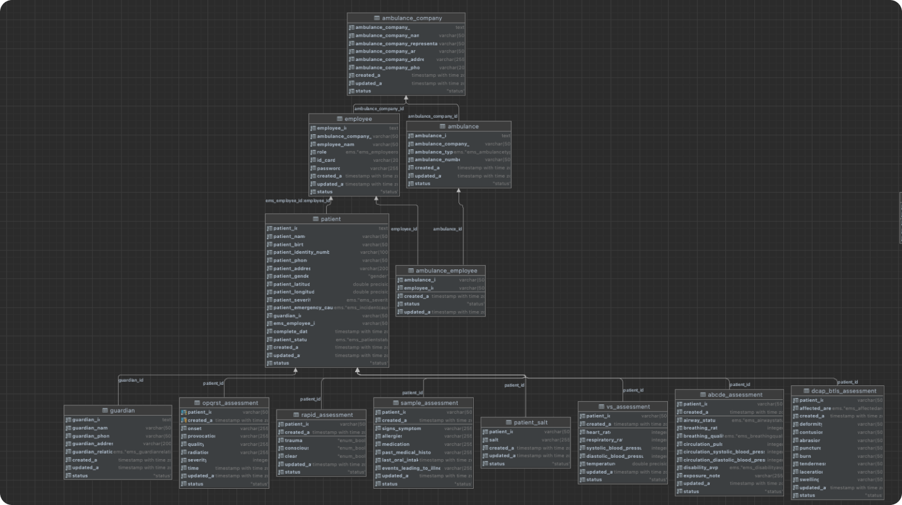

# Hoit - 응급상황 시스템

## 개발스택

### Server

- NestJS
- Nestia
- Prisma
- Kafka
- SocketIO

### Front

- NextJS
- Zustand
- Swr
- SocketIO

### Infra / CICD

- Terraform
- AWS
- Docker
- Jenkins

### 아키텍처

### DB 설계

> 전체
> 

> ER (응급실)
> 

> EMS (구급대원)
> 

> 요청관련
> 

### EMS 구급대원 시스템

> 
> 
> 
> 

### ER 응급실 시스템
 
 
 

